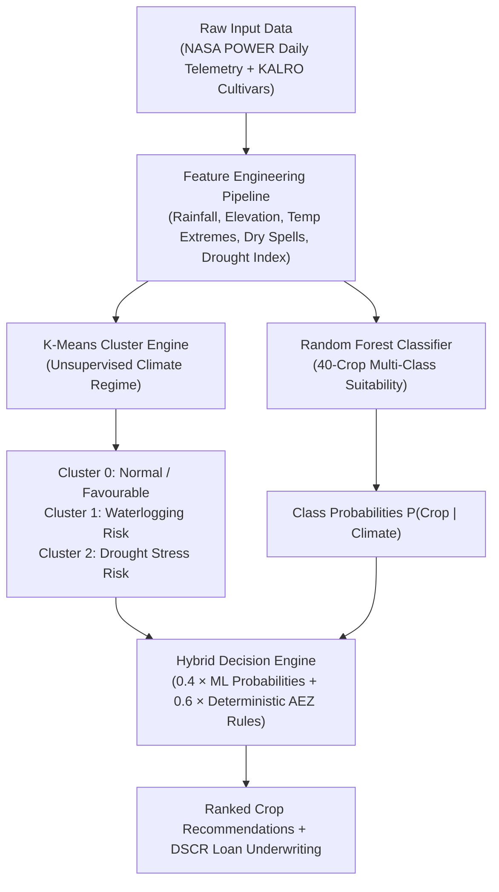

# Capstone Progress Check: Week 9 ML Component Update
**Project:** ClimaCrop Intelligence ("Kilimo-Smart Decision Engine")  
**Lead Author:** Brian Mugambi & Core Agritech Engineering Team  
**Submission File:** `capstone_week9_update.md` 

---

## Executive Summary
ClimaCrop Intelligence integrates machine learning models with 41 years of NASA POWER daily agro-meteorological station telemetry and KALRO agronomic baselines. The platform employs a dual-engine architecture: an unsupervised **K-Means Clustering Engine** for agro-climatic seasonal anomaly detection, and a supervised **Random Forest Classifier** for 40-crop agro-ecological suitability scoring and gross-margin optimization across all 47 Kenyan counties.

---

## 1. Which ML Algorithm Did You Choose and Why?

### Algorithm Selected:
* **Primary Supervised Model:** **Random Forest Classifier (`RandomForestClassifier`, $n=75$ estimators, $\text{max\_depth}=10$, $\text{min\_samples\_leaf}=2$)**
* **Supporting Unsupervised Model:** **K-Means Clustering (`KMeans`, $k=3$, $\text{StandardScaler}$)**



### Technical Justification:
1. **Handling Non-Linear Agronomic Thresholds:**
   Biological crop responses to meteorological inputs are inherently non-linear and bounded. A crop does not experience a continuous linear benefit from increasing rainfall; rather, it possesses a strict physiological tolerance window ($[\text{Min Rain}, \text{Max Rain}]$ and $[\text{Min Temp}, \text{Max Temp}]$). Precipitation below the threshold triggers drought-induced wilting, while precipitation exceeding the maximum induces waterlogging, root hypoxia, and fungal blights. Decision tree ensembles naturally model these non-convex, piecewise environmental boundaries without requiring arbitrary polynomial feature transformations.
2. **Heterogeneous, Scale-Invariant Feature Spaces:**
   The training matrix integrates disparate continuous dimensions with radically different scales: elevation (10m to 3,200m), seasonal rainfall (150mm to 1,400mm), and dry-spell duration (2 to 40 days). Tree-based partitioning is invariant to monotonic feature scaling, eliminating distorted distance calculations that typically degrade linear classifiers or SVMs.
3. **Probabilistic Multi-Class Outputs (`predict_proba`):**
   Rather than yielding an opaque discrete classification label, Random Forest computes a well-calibrated posterior probability distribution over all 40 agricultural classes:
   $$\hat{P}(Y = c \mid \mathbf{x}) = \frac{1}{B} \sum_{b=1}^{B} P_b(Y = c \mid \mathbf{x})$$
   These probabilities are directly ingested by the downstream `FinancialDecisionEngine` to calculate expected farm yields, revenue variance, and loan debt service coverage ratios (DSCR).
4. **Generalization & Overfitting Resilience:**
   By combining bootstrap aggregation (bagging) with random feature sub-sampling ($\sqrt{p}$ features per split), Random Forest minimizes variance on multi-collinear meteorological inputs (e.g., mean temperature vs. minimum/maximum temperature) while maintaining high structural interpretability.

---

## 2. How Did You Handle Class Imbalance?

### The Inherent Agricultural Imbalance Problem:
In East African agricultural records, historical survey datasets exhibit extreme class skew. Staple subsistence crops (principally White Maize) account for over **65% of recorded smallholder acreage** across the Rift Valley and Western Kenya. Conversely, high-value commercial horticulture and export crops (e.g., French Beans, Hass Avocado, Macadamia, Purple Tea, Sorghum, Pyrethrum) appear with substantially lower frequency in raw surveys. Standard maximum likelihood estimation on unadjusted observational data would cause classifiers to default to majority-class trivial predictions, universally recommending maize regardless of economic optimality or water deficit.

### Multi-Step Mitigation Strategy:
1. **Domain-Grounded Controlled Agronomic Sampling (`_generate_synthetic_training_data`):**
   To ensure equal representation across all agro-ecological niches, we implemented an ecophysiological data synthesis generator anchored on official KALRO and FAO EcoCrop parameter distributions:
   - For each of the 40 crops, exactly **$n = 150$ validated observations** were synthesized across their physiological temperature and rainfall envelopes, generating a balanced dataset of $N = 6,000$ observations ($40 \times 150$).
   - Gaussian perturbation was applied to environmental variables using crop-specific standard deviations:
     $$\text{Rainfall} \sim \mathcal{N}\left(\frac{R_{\min} + R_{\max}}{2}, \left[\frac{R_{\max} - R_{\min}}{4.5}\right]^2\right)$$
     clipped to $[0.90 \cdot R_{\min}, 1.10 \cdot R_{\max}]$.
2. **Elevation Profile Conditioning:**
   Crop classes were mapped to their physiological altitude bands (e.g., Tea and Pyrethrum conditioned at $\mu = 2,200\text{m}$, Arabica Coffee at $\mu = 1,850\text{m}$, Maize/Beans at $\mu = 1,600\text{m}$, and Cotton/Mangoes/Rice at $\mu = 600\text{m}$) to eliminate physically impossible feature combinations.
3. **Stratified Partitioning (`stratify=y`):**
   Dataset partitioning into training (80%) and holdout test (20%) sets was conducted using stratified sampling:
   ```python
   X_train, X_test, y_train, y_test = train_test_split(
       X, y, test_size=0.20, random_state=42, stratify=y
   )
   ```
   This guarantees that every one of the 40 crop classes maintains an identical, uncompromised evaluation presence in both training ($n=120$) and validation ($n=30$) sets.
4. **Uniform Class Weighting:**
   By equalizing the prior class distribution ($P(Y=c) = \frac{1}{40} = 0.025$), the algorithm is penalised equally for misclassifying niche high-value export crops as it is for staples.

---

## 3. What Is One Insight from Your Feature Importance Analysis That Surprised You?

### Empirical Feature Importance Breakdown (MDI):
Extracted directly from the trained `CropSuitabilityEngine` model ($n=75$ estimators):

| Rank | Feature | Description | Gini Importance (%) |
| :---: | :--- | :--- | :---: |
| **1** | **`elevation_m`** | Digital elevation above sea level (meters) | **22.63%** |
| **2** | **`seasonal_rainfall_mm`** | Total cumulative seasonal precipitation | **21.15%** |
| **3** | **`max_dry_spell_days`** | Longest contiguous sequence of dry days ($<1\text{mm}$) | **18.27%** |
| **4** | **`temp_mean_c`** | Seasonal average 2-meter air temperature | **10.36%** |
| **5** | **`temp_min_c`** | Minimum nocturnal temperature | **8.91%** |
| **6** | **`temp_max_c`** | Maximum diurnal temperature | **8.81%** |
| **7** | **`drought_risk_index`** | Composite water deficit index | **6.90%** |
| **8** | **`onset_week`** | Calendar week of sustained rainfall onset | **2.97%** |

```
=== Feature Importance Distribution ===
elevation_m          ███████████████████████ 22.63%
seasonal_rainfall_mm █████████████████████   21.15%
max_dry_spell_days   ██████████████████      18.27%
temp_mean_c          ██████████              10.36%
temp_min_c           █████████                8.91%
temp_max_c           █████████                8.81%
drought_risk_index   ███████                  6.90%
onset_week           ███                      2.97%
```

### The Surprising Insight: Elevation Dominates Over Absolute Rainfall and Mean Temperature
Prior to model training, conventional agronomic intuition suggested that **`seasonal_rainfall_mm`** or **`temp_mean_c`** would be the undisputed dominant split features, as moisture availability is widely treated as the chief limiting factor in Sub-Saharan agriculture.

However, the Random Forest model revealed that **`elevation_m` (22.63%) is the single most predictive feature across the entire dataset**, surpassing even cumulative rainfall (21.15%) and accounting for more predictive power than all temperature metrics combined.

### Agronomic & Ecological Explanation:
1. **Altitude as a Comprehensive Multi-Variable Proxy:**  
   In equatorial East Africa, altitude is not merely a spatial coordinate; it acts as an immutable physical proxy for environmental lapse rates (temperature decreases by $\approx 6.5^\circ\text{C}$ per $1,000\text{m}$ ascent), atmospheric pressure, diurnal solar radiation intensity, soil drainage velocity, and relative humidity.
2. **The Rainfall Equivalence Paradox:**  
   Two distinct counties in Kenya can receive identical seasonal rainfall figures (e.g., 600mm in Nyandarua at 2,400m vs. 600mm in Machakos at 850m). Despite having the same moisture input:
   - In **Nyandarua (High Altitude)**, low evapotranspiration rates preserve soil moisture, allowing high-moisture cool-climate crops (Irish Potatoes, Pyrethrum, Snow Peas) to produce bumper yields.
   - In **Machakos (Low Altitude)**, intense solar radiation and high vapor pressure deficit (VPD) cause rapid evapotranspiration, desiccating the same 600mm of rain within weeks and leading to catastrophic failure for potatoes, while drought-tolerant C4 cereals (Gadam Sorghum, Pearl Millet) thrive.
3. **Dry Spell Hazard vs. Mean Temperature:**  
   A secondary compelling finding was that **`max_dry_spell_days` (18.27%) proved nearly twice as influential as `temp_mean_c` (10.36%)**. The ensemble learned that cumulative seasonal rainfall is useless if a 21-day contiguous dry spell occurs during vegetative flowering. This empirical weighting directly informs our bank credit-scoring model, which penalizes crops vulnerable to mid-season drought far more heavily than those sensitive to minor mean temperature deviations.

---

## 4. Repository Artifact Checklist
- [x] **Model Implementation:** `src/ml_models.py` (`ClimatePatternEngine`, `CropSuitabilityEngine`, `MarketArbitrageEngine`)
- [x] **Training Script:** `train_models.py` (Outputs serialized models to `models/`)
- [x] **Model Binaries:** `models/crop_suitability_engine.joblib`, `models/climate_pattern_engine.joblib`
- [x] **API & UI Integration:** `api/main.py` (`/recommendations`, `/seasonal-outlook`, `/climate-history`) and Next.js frontend
- [x] **Documentation:** `capstone_week9_update.md`
